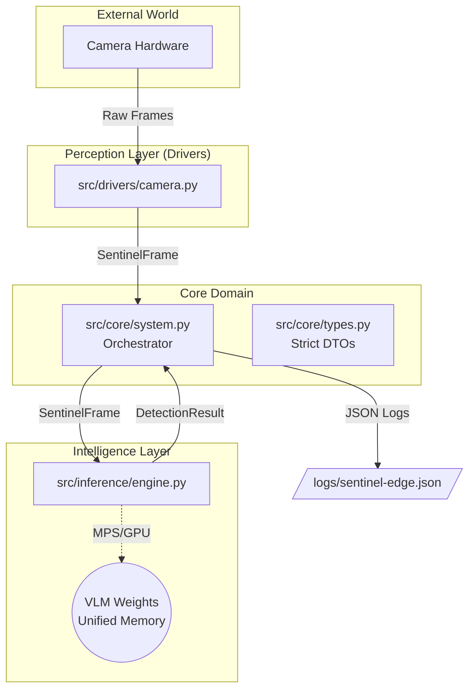

# Sentinel-Edge 🛡️

**Sovereign, Local-First Multimodal Surveillance System**


> **Architected by Ahmed Maaloul** 
> *Showcasing High-Reliability Engineering & Edge AI on Apple Silicon*

---

## 📖 Introduction

**Sentinel-Edge** is an industrial-grade anomaly detection system built strictly for high-security, high-reliability environments. Unlike cloud-dependent solutions, Sentinel-Edge runs **100% locally** on Apple Silicon (M1 Pro+), leveraging **Metal Performance Shaders (MPS)** to execute Vision-Language Models (VLMs) at the edge with zero external API calls.

This project demonstrates expertise in:
- **Systems Programming**: Signal handling, concurrency, and resource management.
- **Edge AI Optimization**: Using the `MLX` framework for hardware-accelerated inference.
- **Clean Architecture**: A strict separation of concerns for maintainability and testability.

## ⚡ Key Highlights

### 🚀 Zero-Latency Local Intelligence
Optimized for the Apple Neural Engine (ANE) and GPU.
- **Framework**: Built on Apple's [MLX](https://github.com/ml-explore/mlx) for unified memory efficiency.
- **Model**: Runs quantized VLMs (e.g., `Qwen2.5-VL-Int4`) directly on-device.
- **Privacy**: No data leaves the machine. Ideal for GDPR-compliant and sovereign industrial zones.

### 🛡️ "German Engineering" Standards
Built with a focus on robustness and stability:
- **Automatic Recovery**: The `CameraDriver` implements a "deadman switch" to automatically reconnect if hardware fails.
- **Type Safety**: 100% strictly typed Python codebase.
- **Structured Telemetry**: JSON-structured logging via `loguru` for seamless integration with observability stacks (Datadog/Splunk).
- **Graceful Shutdown**: Handles `SIGINT` signals to safely release hardware reources.

## 🏗️ System Architecture

The codebase follows **Clean Architecture** principles to decouple the domain logic from hardware and AI frameworks.



### Directory Structure
- `src/core`: Pure domain logic, DTOs, and abstract interfaces. No external dependencies.
- `src/drivers`: Hardware abstraction (OpenCV) with reconnection capability.
- `src/inference`: MLX-specific implementation of the inference engine.
- `src/telemetry`: Structured logging usage.

## 🔧 M1 Pro Performance Tuning

**Strict Requirement**: NO CUDA. This project is meticulously tuned for Apple's Unified Memory Architecture.

1.  **Metal Performance Shaders (MPS)**:
    All matrix operations are dispatched to the `mps` device backend via `mlx`.

2.  **Unified Memory (RAM)**:
    - **Optimization**: Transitions tensors between CPU (OpenCV frame capture) and GPU (MLX Inference) zero-copy where possible.
    - **Footprint**: Tuned for 16GB Unified Memory systems using 4-bit quantized weights.
    - **Thermal**: Driver loop includes throttling hooks to prevent thermal throttling during long-running industrial shifts.

## 🛠️ Usage

### Prerequisites
- macOS (Apple Silicon M1/M2/M3).
- Python 3.9+.

### Installation

```bash
# 1. Clone the repository (if you haven't already)
cd SentinelEdge

# 2. Create and Activate Virtual Environment (Recommended)
python3 -m venv .venv
source .venv/bin/activate

# 3. Install dependencies
pip install -e .
```

### Running the System

```bash
# Start the surveillance loop
# (First run will download the ~4GB quantized model to cache)
python src/main.py --model "mlx-community/Qwen2.5-VL-7B-Instruct-4bit" --camera 0
```

### Testing

Comprehensive unit tests verifying the architecture and mocking hardware.

```bash
pytest
```

---
*Created by [Ahmed Maaloul](https://github.com/ahmedmaaloul).*
